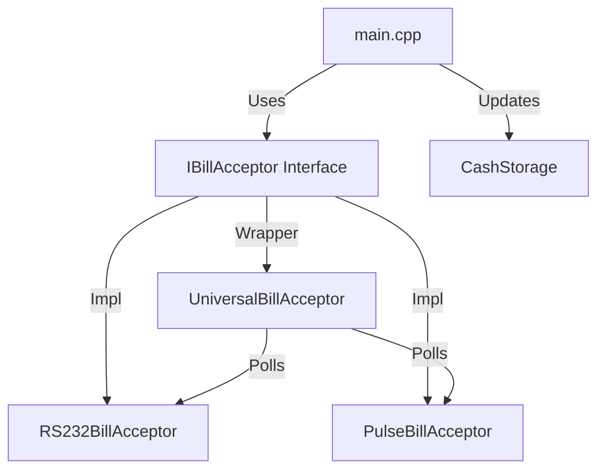
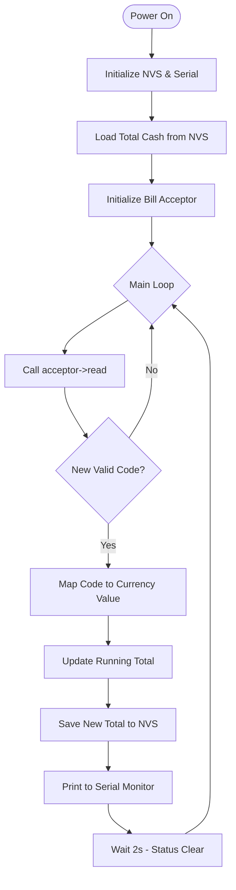

# System Architecture

The ESP32 Vending Controller is designed with a modular, interface-driven architecture to support multiple bill acceptor protocols simultaneously.

## Component Overview

### Core Libraries

#### 1. BillAcceptor (`lib/BillAcceptor`)
Handles communication with the hardware.
- **`IBillAcceptor`**: Abstract base class defining `begin()`, `read()`, `enable()`, and `disable()`.
- **`RS232BillAcceptor`**: High-security serial driver (9600 baud, 8E1).
- **`PulseBillAcceptor`**: High-speed interrupt-driven pulse counter.
- **`UniversalBillAcceptor`**: A protocol-agnostic wrapper that allows both modes to run in parallel.

#### 2. VendingSystem (`lib/VendingSystem`)
Manages high-level state.
- **`CashStorage`**: Persistent tracking of total money accepted via NVRAM.

## Operational Flow

The following diagram illustrates the main application logic:

### Communication Flow
1. **Pulse**: Interrupts increment a volatile counter; `read()` checks for a 500ms inactivity timeout before returning a value.
2. **RS232**: Periodic polling for hex bytes via HardwareSerial (Serial2).
3. **Storage**: Values are stored in NVS/EEPROM to survive power failure.
